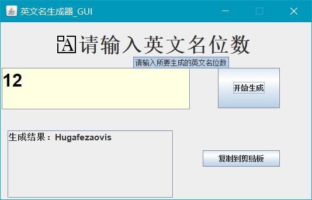
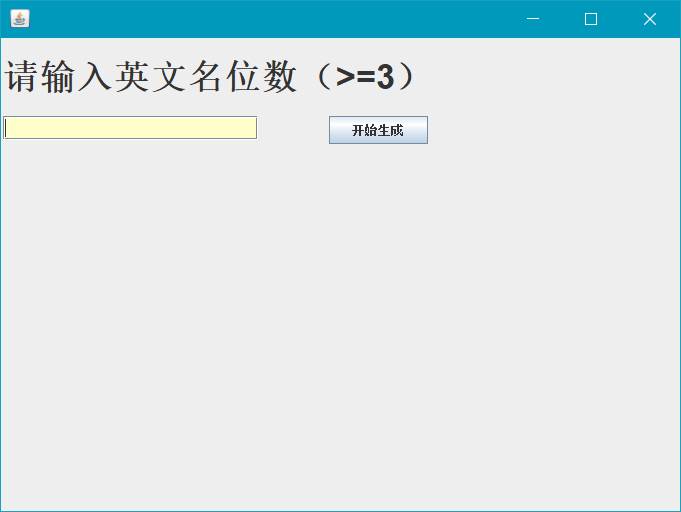

# 英文名称生成器

## 简介

主程序为`gui.GUI`，无gui版主程序为`Name`。

### pack.GeneraName用法：

GeneraName name = new GeneraName(int length);

返回值：String

### 运行方法

使用`javaw -jar GUI.jar`或者编译后用`javaw gui.GUI`运行。

以无GUI方式运行：`java -cp GUI.jar Name`

## 效果

### v1.0.1

### v1.0.0

